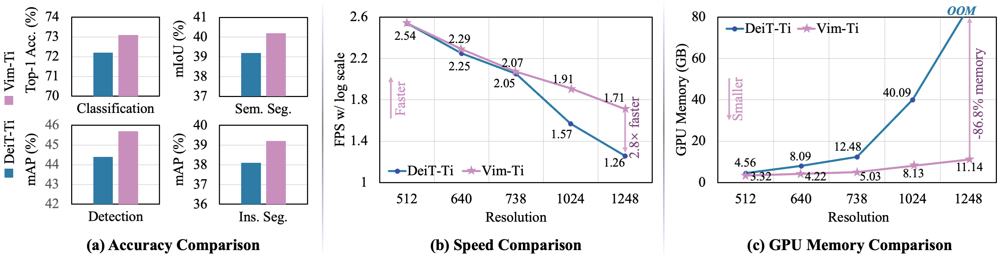
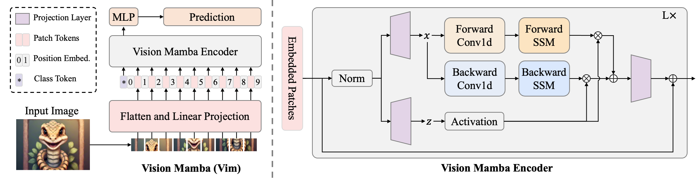

<div align="center">
<h1>Vision Mamba </h1>
<h3>Efficient Visual Representation Learning with Bidirectional State Space Model</h3>

[Lianghui Zhu](https://github.com/Unrealluver)<sup>1</sup> \*,[Bencheng Liao](https://github.com/LegendBC)<sup>1</sup> \*,[Qian Zhang](https://scholar.google.com/citations?user=pCY-bikAAAAJ&hl=zh-CN)<sup>2</sup>, [Xinlong Wang](https://www.xloong.wang/)<sup>3</sup>, [Wenyu Liu](http://eic.hust.edu.cn/professor/liuwenyu/)<sup>1</sup>, [Xinggang Wang](https://xwcv.github.io/)<sup>1 :email:</sup>

<sup>1</sup>  Huazhong University of Science and Technology, <sup>2</sup>  Horizon Robotics,  <sup>3</sup> Beijing Academy of Artificial Intelligence

(\*) equal contribution, (<sup>:email:</sup>) corresponding author.

ArXiv Preprint ([arXiv 2401.09417](https://arxiv.org/abs/2401.09417)), HuggingFace Page ([🤗 2401.09417](https://huggingface.co/papers/2401.09417))


</div>


#


### News
* **` Feb. 10th, 2024`:** We update Vim-tiny/small weights and training scripts. By placing the class token at middle, Vim achieves improved results. Further details can be found in code and our updated [arXiv](https://arxiv.org/abs/2401.09417).

* **` Jan. 18th, 2024`:** We released our paper on Arxiv. Code/Models are coming soon. Please stay tuned! ☕️


## Abstract
Recently the state space models (SSMs) with efficient hardware-aware designs, i.e., the Mamba deep learning model, have shown great potential for long sequence modeling. Meanwhile building efficient and generic vision backbones purely upon SSMs is an appealing direction. However, representing visual data is challenging for SSMs due to the position-sensitivity of visual data and the requirement of global context for visual understanding. In this paper, we show that the reliance on self-attention for visual representation learning is not necessary and propose a new generic vision backbone with bidirectional Mamba blocks (Vim), which marks the image sequences with position embeddings and compresses the visual representation with bidirectional state space models. On ImageNet classification, COCO object detection, and ADE20k semantic segmentation tasks, Vim achieves higher performance compared to well-established vision transformers like DeiT, while also demonstrating significantly improved computation & memory efficiency. For example, Vim is 2.8x faster than DeiT and saves 86.8% GPU memory when performing batch inference to extract features on images with a resolution of 1248x1248. The results demonstrate that Vim is capable of overcoming the computation & memory constraints on performing Transformer-style understanding for high-resolution images and it has great potential to be the next-generation backbone for vision foundation models.


<div align="center">

</div>

## Overview
<div align="center">

</div>

## Envs. for Pretraining

- Python 3.10.13

  - `conda create -n your_env_name python=3.10.13`

- torch 2.1.1 + cu118
  - `pip install torch==2.1.1 torchvision==0.16.1 torchaudio==2.1.1 --index-url https://download.pytorch.org/whl/cu118`

- Requirements: vim_requirements.txt
  - `pip install -r vim/vim_requirements.txt`

- Install ``causal_conv1d`` and ``mamba``
  - `pip install -e causal_conv1d>=1.1.0`
  - `pip install -e mamba-1p1p1`
  
  


## Train Your Vim

`bash vim/scripts/pt-vim-t.sh`

## Train Your Vim at Finer Granularity
`bash vim/scripts/ft-vim-t.sh`

## Model Weights

| Model | #param. | Top-1 Acc. | Top-5 Acc. | Hugginface Repo |
|:------------------------------------------------------------------:|:-------------:|:----------:|:----------:|:----------:|
| [Vim-tiny](https://huggingface.co/hustvl/Vim-tiny-midclstok)    |       7M       |   76.1   | 93.0 | https://huggingface.co/hustvl/Vim-tiny-midclstok |
| [Vim-tiny<sup>+</sup>](https://huggingface.co/hustvl/Vim-tiny-midclstok)    |       7M       |   78.3   | 94.2 | https://huggingface.co/hustvl/Vim-tiny-midclstok |
| [Vim-small](https://huggingface.co/hustvl/Vim-small-midclstok)    |       26M       |   80.5   | 95.1 | https://huggingface.co/hustvl/Vim-small-midclstok |
| [Vim-small<sup>+</sup>](https://huggingface.co/hustvl/Vim-small-midclstok)    |       26M       |   81.6   | 95.4 | https://huggingface.co/hustvl/Vim-small-midclstok |

**Notes:**
- <sup>+</sup> means that we finetune at finer granularity with short schedule.
## Evaluation on Provided Weights
To evaluate `Vim-Ti` on ImageNet-1K, run:
```bash
python main.py --eval --resume /path/to/ckpt --model vim_tiny_patch16_224_bimambav2_final_pool_mean_abs_pos_embed_with_midclstok_div2 --data-path /path/to/imagenet
```
## Acknowledgement :heart:
This project is based on Mamba ([paper](https://arxiv.org/abs/2312.00752), [code](https://github.com/state-spaces/mamba)), Causal-Conv1d ([code](https://github.com/Dao-AILab/causal-conv1d)), DeiT ([paper](https://arxiv.org/abs/2012.12877), [code](https://github.com/facebookresearch/deit)). Thanks for their wonderful works.

## Citation
If you find Vim is useful in your research or applications, please consider giving us a star 🌟 and citing it by the following BibTeX entry.

```bibtex
 @article{vim,
  title={Vision Mamba: Efficient Visual Representation Learning with Bidirectional State Space Model},
  author={Lianghui Zhu and Bencheng Liao and Qian Zhang and Xinlong Wang and Wenyu Liu and Xinggang Wang},
  journal={arXiv preprint arXiv:2401.09417},
  year={2024}
}
```
